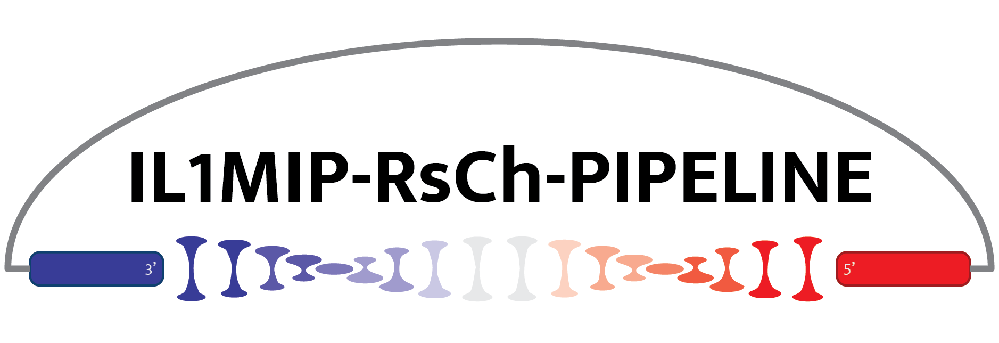
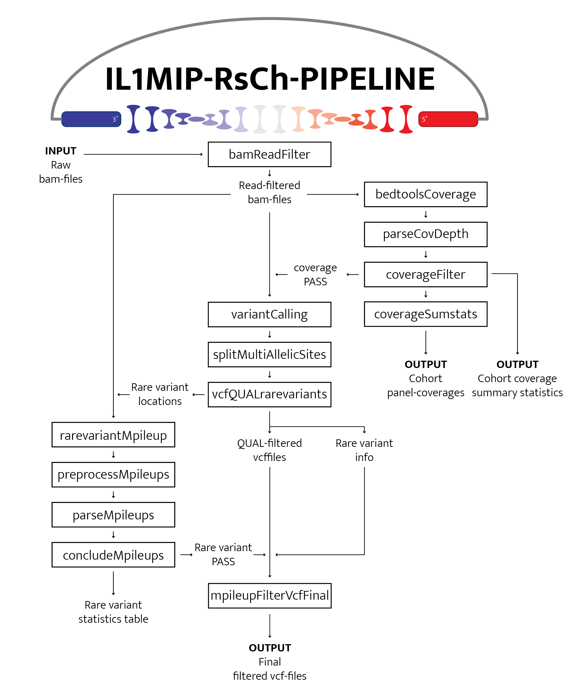

# **IL1MIP-RsCh-PIPELINE**
A DNA analysis pipeline for research Molecular Inversion Probe sequencing Interleukin-1 panel data.\
&nbsp;


### **DESCRIPTION**
IL1MIP-RsCh-PIPELINE was designed to provide reliable common and rare variant calls from Interleukin(IL)-1 panel Molecular Inversion Probe (MIP)-sequencing data for the purpose of large-cohort analyses. In brief, this pipeline excludes poor quality reads from input bam-files, generates coverage (summary) statistics, calls variants with GATK UnifiedGenotyper, and finally excludes rare variants based on QUAL-parameter in the vcf-file and mpileup statistics.\
&nbsp;

### **QUICKSTART**
Install Nextflow:
  - See installation instructions [link](https://www.nextflow.io/)

Install Singularity:
  - See installation instructions [link](https://sylabs.io/guides/3.0/user-guide/installation.html)

Download container images in `./containers/` folder:
  - bcftools 1.9: `singularity pull library://weizhu365/mocca-sv/bcftools_1-9:1.0.0`
  - bedtools 2.29: `singularity pull library://marialitovchenko/default/bedtools`
  - GATK 3.8.1: `singularity pull docker://broadinstitute/gatk3:3.8-1`
  - Perl 5.18.4: `singularity pull docker://perl:5.18.4-threaded-stretch`
  - Python 2.7 (includes modules pysam, numpy and pandas): ``
  - Samtools 1.11: `singularity pull library://daanjg98/rnaseq/samtools:1.11`

Download reference genome Hg19 (ref_hg19.fasta, including accompanying ref_hg19.fasta.fai, ref_hg19.dict, and ref_hg19.dict.fai) in `./references/` folder:
  - For instance from [link](http://hgdownload.cse.ucsc.edu/goldenPath/hg19/chromosomes/)

Specify required parameters in [nextflow.config](nextflow.config):
  - mainDir: Absolute path on your system to where you have installed IL1MIP-RsCh-PIPELINE
  - runID: Name of the run/cohort you wish to process
  - input: Relative path from `mainDir` to input bam-files.

Run IL1MIP-RsCh-PIPELINE with the following command:
  ```
  nextflow run main.nf -c nextflow.config
  ```
&nbsp;

### **RUNNING**
First, make sure all components are installed, images are downloaded and required parameters are set (see QUICKSTART section).
#### **Input**
Input consists of one or more sorted bam-files (and accompanying index .bam.bai) aligned by BWA-MEM and headered with PICARD tools. The relative path should be specified in the [nextflow.config](nextflow.config) with the `input` parameter.
#### **Output**
Upon running, output is stored in an `out` folder that is newly created, in which three sub-folders are created:
1. `./bamFiles/`: will contain the read-filtered bam-files as outputted by process `bamReadFilter`
2. `./covFiles/`: will contain one file with panel-average coverage depth for all samples included in the run and one file with coverage depth summary statistics in terms of minimal, maximum, mean and median coverage (per gene, autosomal genes, X-chromosomal genes) for all samples that are included in variant-calling
3. `./vcfFiles/`: will contain the final filtered vcf-files and a rare variant statistics table with information regarding true/false positivity for all samples that are included in variant-calling
#### **Parameters**
Aside from the parameters that are required in the QUICKSTART section, there are additional process-specific parameters that may be adjusted globally in the [nextflow.config](nextflow.config) or for single-time use on the command-line:

  `--coverageThreshold`
  - parameter in process coverageFilter
  - threshold that is used to exclude samples from variant calling with a panel-average coverage depth below this threshold
  - default = 100x

  `--gatk_dcov`
  - paramater in process variantCalling
  - the downsampling coverage threshold per locus
  - default = 5000


  `--gatk_dt`
  - paramater in process variantCalling
  - parameter that specifies whether the coverage should be assessed per sample, technology or otherwise
  - default = "BY_SAMPLE"


  `--gatk_rf`
  - paramater in process variantCalling
  - parameter that specifies which reads should be filtered out before calling variants
  - default = "BadCigar"


  `--gatk_glm`
  - paramater in process variantCalling
  - the parameter that specifies whether to call single-nucleotide variants (SNVs), indels, or both
  - default = "BOTH"


  `--gatk_stand_call_conf`
  - paramater in process variantCalling
  - the Phred threshold of confidence is required to consider a site confidently called
  - default = 30.0

>Note: IL1MIP-RsCh-PIPELINE has not been tested with settings other than these default settings. In addition, remaining parameters such as paths to scripts, output-folders, or publish parameters may also be adjusted in similar manner.
&nbsp;

&nbsp;

### **WORKFLOW**
\
&nbsp;

### **REQUIREMENTS**
- Nextflow 20.10.0 (or later) [link](https://www.nextflow.io/)
- Java 8
- Singularity 3.5.1 (or later) [link](https://sylabs.io/guides/3.0/user-guide/installation.html)
&nbsp;

### **AUTHOR**
Rosanne C. van Deuren
